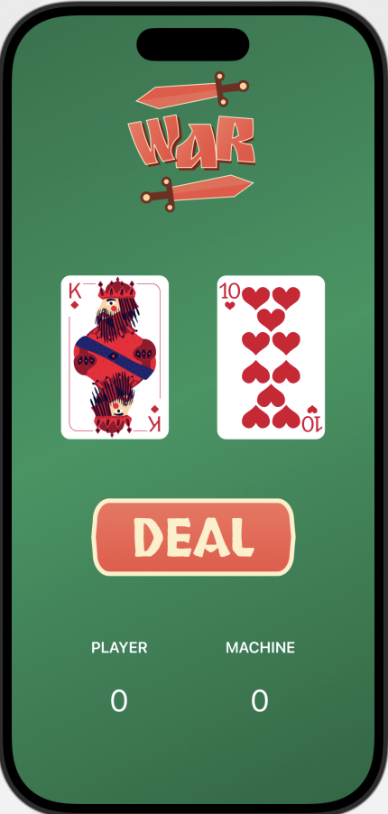

# Cards Game

A simple SwiftUI card game: you versus the machine. Each round both sides draw a card, and the higher value wins a point.



## How to play

1. Open the app.
2. Tap **Deal**.
3. You and the machine each receive a random card (2 through Ace).
4. The higher card scores 1 point. Ties score nothing.
5. Keep dealing. The running scores stay on screen.

## Requirements

- Xcode 16 or later
- A simulator or device running one of:
  - iOS 18.5+
  - macOS 15.5+
  - visionOS 2.5+

## Getting started

1. Clone this repository.
2. Open `cardsgame.xcodeproj` in Xcode.
3. Select a destination (iPhone, iPad, Mac, or Apple Vision).
4. Press **Run**.

## Project layout

```
cardsgame/                 App source and assets
  ContentView.swift        Game UI and scoring
  cardsgameApp.swift       App entry point
  Assets.xcassets          Cards, backgrounds, logo, deal button
cardsgameTests/            Unit tests
cardsgameUITests/          UI tests
cardsgame.xcodeproj        Xcode project
```

## License

Private project. All rights reserved.
